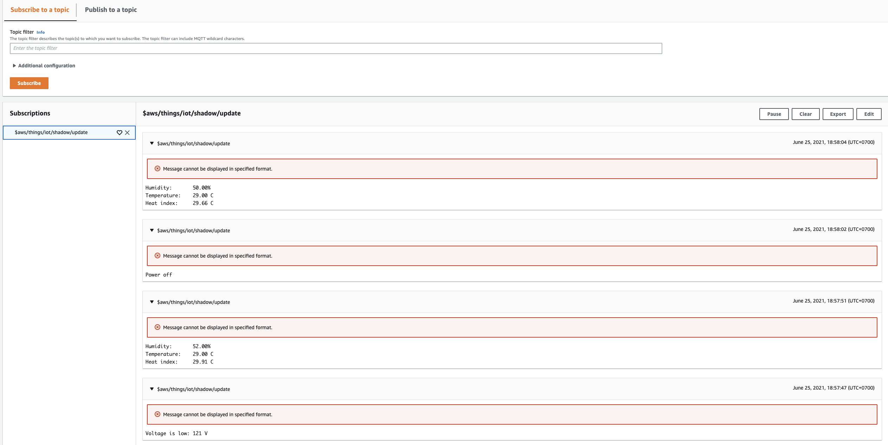
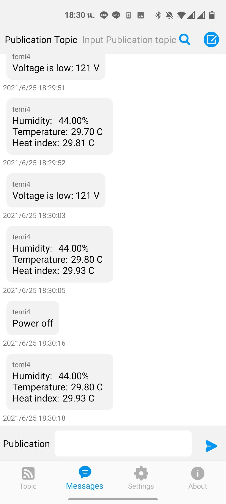
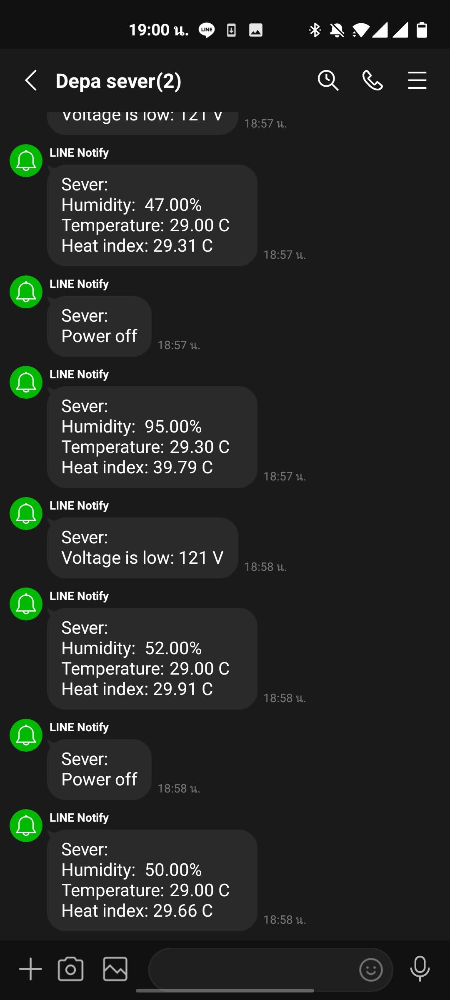
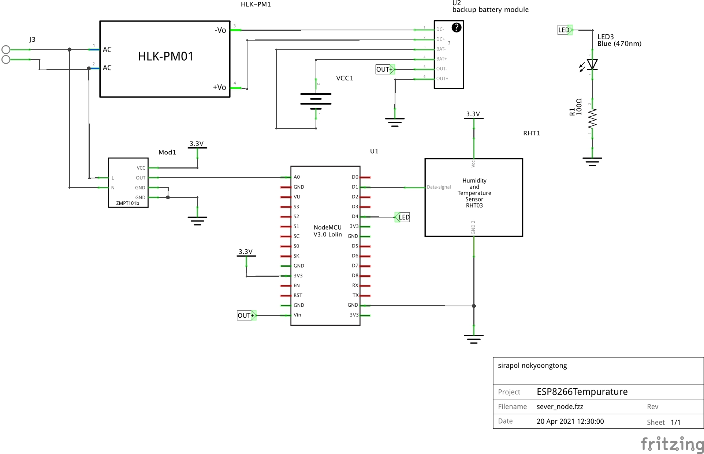
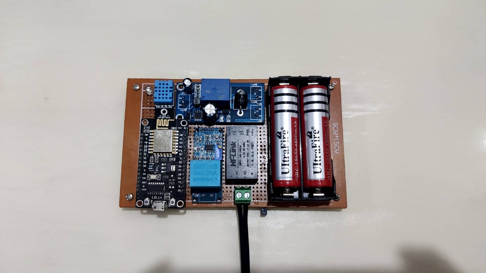
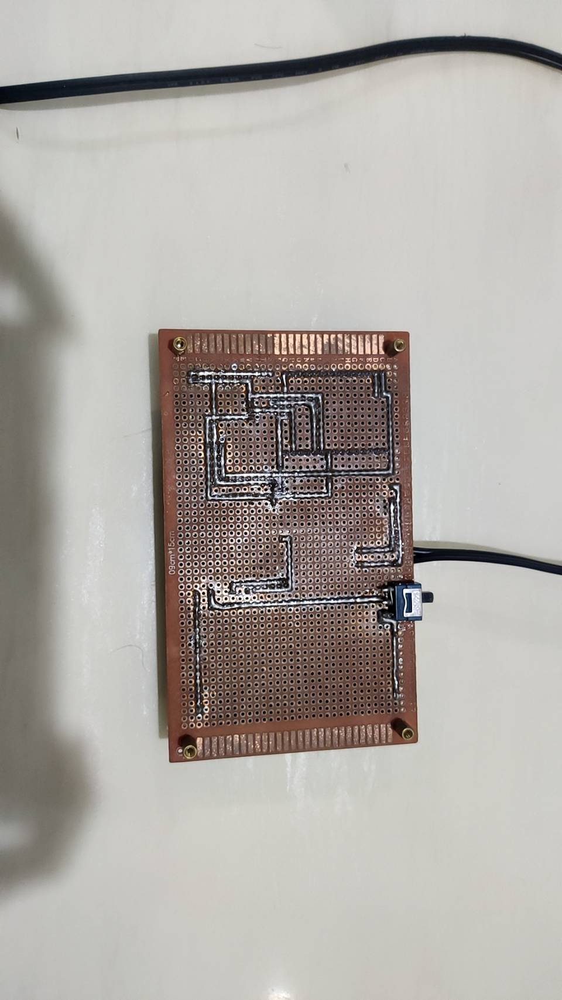

# ESP8266Tempurature
## ภาพรวมโครงการ

โครงการนี้เป็นการจัดทำระบบที่ทำงานหลายฟังก์ชั่นด้วยกัน โดยระบบจะเก็บข้อมูลฝุ่นควัน PM2.5 อุณหภูมิสภาพแวดล้อม และการวัดไข้เมื่อมีสิ่งของเข้ามาใกล้เซนเซอร์ โดยแต่ละฟังก์ชั่นจะมีขั้นตอนการทำงานดังนี้

 1. **ระบบวัดอุณหภูมิสภาพแวดล้อม** ตรวจจับอุณหภูมิสภาพแวดล้อม และส่งค่าไปยัง AWS Server
 2. **ระบบแจ้งเตือนแรงดันไฟฟ้า ตรวจจับแรงดันไฟฟ้า และส่งค่าไปยัง AWS Server

ในโครงการนี้จะจัดทำโค้ดสำหรับส่งข้อมูลสองแบบด้วยกัน คือ ใช้ AWS IoT Core สำหรับบริการ PubSub และอีกรูปแบบคือ ใช้ MQTT Server ในการส่งข้อมูล

  
 

 
  
  
  

## อุปกรณ์ที่ใช้

 1. NodeMCU ESP8266
 2. DHT 11
 3. AC voltage sensor (ZMPT101B)
 4. Lithium battery 18650 3.7V 4800ma
 5. Automatic switching of backup battery
 6. Hi Link Power module 5V 600ma
 7. LED ขนาด 5mm
 8. ซอฟต์แวร์ Arduino 1.6.8
 9. ESP8266 2.4.2
 10. Python2 หรือ 3
 11. git

## แผงวงจร

ให้เดินสายอุปกรณ์และเซนเซอร์ต่างๆ ตามภาพ

  

  

  

 

## จัดทำโค้ดสำหรับโครงการ

### ติดตั้ง Arduino 1.6.8

ดาวน์โหลด Arduino โดยให้เลือกเป็นเวอร์ชั่น 1.6.8

### ติดตั้งบอร์ด ESP8266
 1. เปิดโปรแกรม Arduino ไปที่ Preference
 2. เพิ่ม http://arduino.esp8266.com/stable/package_esp8266com_index.json ลงในช่อง Additional Board Manager
 3. ที่โปรแกรม Arduino เปิดบอร์ด Manager
 4. เลือก esp8266 โดยให้ติดตั้งเวอร์ชั่น 2.4.2
 5. เข้าไปที่โฟลเดอร์ Documents/Arduino/hardware/esp8266com (หากยังไม่มี ให้สร้างโฟลเดอร์ขึ้นมา)
 6. เปิด Terminal เข้าไปที่โฟลเดอร์ข้างต้น พิมพ์คำสั่ง git clone https://github.com/esp8266/Arduino.git esp8266
 7. cd เข้าไปที่โฟลเดอร์ esp8266/tools (Documents/Arduino/hardware/esp8266com/esp8266/tools)
 8. พิมพ์คำสั่ง python get.py

### เขียนโค้ด

ดาวน์โหลดโค้ดของ Git โครงดารนี้ โดยคุณจะเห็นโฟลเดอร์ code ให้นำไฟล์ทั้งหมดไปไว้ยัง Wordspace ของ Arduino แล้วเปิดไฟล์ขึ้นมาแก้ไข
